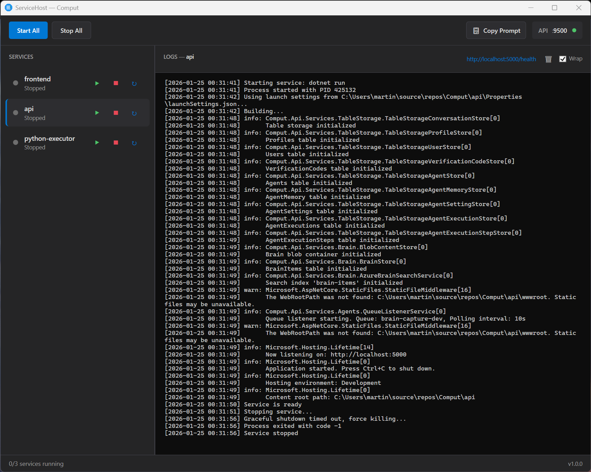

# ServiceHost

A Windows service manager with WPF and terminal UIs plus an HTTP API designed for AI assistant integration.




## Why ServiceHost?

When AI assistants spawn services directly, processes can linger after the session ends, leaving ports blocked and requiring manual cleanup. ServiceHost solves this by providing a dedicated service manager that:

- Gives you visibility and control over running services
- Persists across AI assistant sessions
- Provides clean start/stop/restart operations

Typical use cases:

- **Backend API** - ASP.NET Core, Express, FastAPI, Go servers
- **Frontend dev server** - Vite, Webpack, Next.js, Angular CLI
- **Database** - Local PostgreSQL, Redis, MongoDB instances
- **Workers** - Background job processors, queue consumers
- **Sidecars** - Auth proxies, mock servers, local S3/Azure emulators

## Features

- **WPF UI** - Dark themed interface with service list, controls, and log viewer
- **TUI** - Terminal UI for running ServiceHost inside terminal multiplexers such as Herdr
- **HTTP API** - Self-describing REST API on localhost:9500
- **Process Management** - Start, stop, restart services with stdout/stderr capture
- **Shell Mode** - cmd /c args are auto-joined for correct npm/npx PATH propagation
- **Persistent Services** - Services keep running when UI closes
- **Auto-Reload Config** - Edit `ServiceHost.json` and changes are picked up on next API request
- **Service CRUD via API** - Create, update, delete services via REST endpoints
- **Auto-Update Check** - WPF checks GitHub releases and can stage/apply updates
- **Copy Prompt** - One-click button copies an AI assistant prompt to your clipboard
- **AI Ready** - API returns self-describing manifest for AI assistants

## Quick Start

```powershell
# Clone and run the WPF UI
git clone https://github.com/mbundgaard/ServiceHost.git
cd ServiceHost
.\dev.ps1

# Or run the terminal UI
.\dev-tui.ps1
```

Installed/shared usage from a project root:

```powershell
servicehost-tui --config .\ServiceHost.json

# Use a runtime API port override when multiple projects run at once
servicehost-tui --config .\ServiceHost.json --port 9510
```

Or publish executables:

```powershell
.\publish.ps1      # Output: publish/ServiceHost.exe
.\publish-tui.ps1  # Output: publish-tui/ServiceHost.Tui.exe
```

## Configuration

Projects should check in `ServiceHost.json` with non-secret service configuration only. Real credentials should live in a separate gitignored credentials file and be referenced with placeholders such as `${MUNERIS_KIOSK_DB}`. Session-only credentials may also be uploaded to the API with `POST /credentials/session`; they are kept in memory only, never returned by the API, and cleared on shutdown. The credentials design is documented in `docs/plans/2026-08-27-config-credentials-separation.md`; the API/TUI exposes resolved/unresolved credential status without exposing secret values.

Create `ServiceHost.json` next to the executable, or pass a project config explicitly:

```powershell
ServiceHost.Tui.exe --config D:\Source\MyProject\ServiceHost.json --port 9510
```

Config path resolution order:

1. `--config <path>`
2. `SERVICEHOST_CONFIG`
3. `./ServiceHost.json` in the current working directory
4. `ServiceHost.json` next to the executable

API port resolution order:

1. `--port <port>`
2. `SERVICEHOST_PORT`
3. `apiPort` in `ServiceHost.json`
4. default `9500`

Relative `logDirectory` and service `workingDirectory` values are resolved relative to the config file directory.

Example config:

```json
{
  "apiPort": 9500,
  "logDirectory": "./logs",
  "services": [
    {
      "name": "api",
      "command": "dotnet",
      "args": ["run"],
      "workingDirectory": "./api",
      "port": 5000,
      "url": "http://localhost:5000/health",
      "environment": {
        "ASPNETCORE_ENVIRONMENT": "Development"
      }
    },
    {
      "name": "frontend",
      "command": "cmd",
      "args": ["/c", "npm", "run", "dev"],
      "workingDirectory": "./app",
      "port": 5173,
      "url": "http://localhost:5173"
    }
  ]
}
```

### Service Options

| Field | Description |
|-------|-------------|
| `name` | Unique service identifier |
| `command` | Executable to run. Use `cmd` with `["/c", ...]` args on Windows for npm/npx |
| `args` | Command-line arguments (array) |
| `workingDirectory` | Working directory for the process |
| `port` | Required port the service binds to; used for process adoption and conflict cleanup |
| `url` | Clickable URL shown in UI (e.g., health endpoint or main page) |
| `environment` | Environment variables (optional) |
| `shutdownTimeoutSeconds` | Graceful shutdown timeout (default: 5) |

## HTTP API

### Discovery Endpoint

```bash
curl http://localhost:9500/
```

Returns a self-describing manifest with all endpoints, examples, and current service status:

```json
{
  "name": "ServiceHost",
  "version": "9",
  "description": "Service manager with HTTP API for AI assistants",
  "apiPort": 9500,
  "configPath": "D:/path/to/ServiceHost.json",
  "projectDirectory": "D:/path/to",
  "endpoints": {
    "GET /": "API description and service status",
    "GET /services": "List all services",
    "POST /services": "Create a new service",
    "PUT /services/{name}": "Update an existing service",
    "DELETE /services/{name}": "Delete a service",
    "GET /services/{name}/logs?tail=N": "Get last N lines of logs",
    "POST /credentials/session": "Upload session-only credentials as a JSON object; values stay in memory and are never returned",
    "DELETE /credentials/session": "Clear all session-only credentials from memory",
    "POST /services/start": "Start all services",
    "POST /services/stop": "Stop all services",
    "POST /services/restart": "Restart all services",
    "POST /services/{name}/start": "Start a service",
    "POST /services/{name}/stop": "Stop a service",
    "POST /services/{name}/restart": "Restart a service",
    "POST /shutdown": "Shutdown the application"
  },
  "services": [...]
}
```

### Examples

```bash
# Start all services
curl -X POST http://localhost:9500/services/start

# Start a specific service
curl -X POST http://localhost:9500/services/api/start

# Stop a service
curl -X POST http://localhost:9500/services/api/stop

# Restart a service
curl -X POST http://localhost:9500/services/api/restart

# Get logs (last 50 lines)
curl http://localhost:9500/services/api/logs?tail=50

# Upload temporary session-only credentials (values are never returned by API)
curl -X POST http://localhost:9500/credentials/session \
  -H "Content-Type: application/json" \
  -d '{"MUNERIS_KIOSK_DB":"Server=...;Password=..."}'

# Clear session-only credentials
curl -X DELETE http://localhost:9500/credentials/session

# Create a new service
curl -X POST http://localhost:9500/services \
  -H "Content-Type: application/json" \
  -d '{"name":"worker","command":"node","args":["worker.js"]}'

# Update a service
curl -X PUT http://localhost:9500/services/worker \
  -H "Content-Type: application/json" \
  -d '{"name":"worker","command":"node","args":["worker-v2.js"]}'

# Delete a service
curl -X DELETE http://localhost:9500/services/worker

# Shutdown application (for updates)
curl -X POST http://localhost:9500/shutdown
```

### Response Format

```json
// Success
{ "success": true, "name": "api", "status": "running", "pid": 12345 }

// Failure
{ "success": false, "name": "api", "error": "Failed to start process" }
```

## UI

ServiceHost can be run with either the WPF UI or the terminal UI. Both use the same core runtime and keep the HTTP API available.

The dark-themed WPF UI provides:

- **Service List** - Status indicator, name, and start/stop/restart buttons
- **Log Viewer** - Real-time log display for selected service
- **Batch Controls** - Start All / Stop All buttons
- **Copy Prompt** - Copies an AI assistant prompt to clipboard for quick integration

Status indicators:
- Green: Running
- Gray: Stopped
- Orange: Starting/Stopping
- Red: Failed

The TUI uses a stacked layout optimized for Herdr panes: services at the top and selected-service logs below. Keyboard controls:
- `F2` start/stop selected
- `F3` restart selected
- `F4` start/stop all
- `Ctrl+L` clear selected log
- `Ctrl+Q` quit UI

## AI Assistant Integration

ServiceHost is designed to work with AI coding assistants (Claude Code, Cursor, Windsurf, etc.):

1. Start ServiceHost with your project's services configured
2. Click **Copy Prompt** to copy a ready-to-use prompt to your clipboard
3. Paste the prompt into your AI assistant - it will discover the API via curl
4. The AI assistant can start/stop/restart services and fetch logs as needed

The API manifest includes configuration details, so AI assistants know how to add or modify services in `ServiceHost.json`. Changes are auto-detected on the next API request.

Services persist when the UI closes, so you can:
- Start services via the UI
- Close ServiceHost
- Let the AI assistant manage services via the API
- Reopen ServiceHost to see current status

## Releases & Updates

Download the latest release assets from GitHub Releases:

- WPF: [ServiceHost.exe](https://github.com/mbundgaard/ServiceHost/releases/latest/download/ServiceHost.exe)
- TUI: [ServiceHost.Tui.exe](https://github.com/mbundgaard/ServiceHost/releases/latest/download/ServiceHost.Tui.exe)

The WPF front-end checks GitHub releases for updates in the background and can stage/apply a downloaded update. The shared update/relaunch helpers live in `ServiceHost.Core`.

## Project Structure

```text
src/
├── ServiceHost.sln
├── ServiceHost.Core/   # shared config/process/log/API/runtime
├── ServiceHost.Wpf/    # WPF front-end
└── ServiceHost.Tui/    # Terminal.Gui front-end
```

## Building

Requirements:
- .NET 8.0 SDK
- Windows

```powershell
# Development
.\dev.ps1      # WPF
.\dev-tui.ps1  # TUI

# Publish
.\publish.ps1
.\publish-tui.ps1
```

## License

MIT
